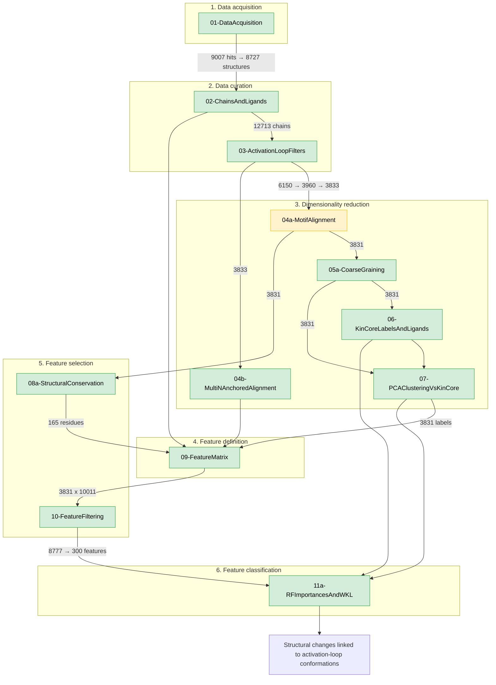

# KinLoopMap

Mapping kinase activation-loop conformational landscapes from experimental structures.

This repository implements an end-to-end modelling pipeline: acquire and curate kinase structures related to a BRAF reference, analyse activation-loop geometry with dimensionality reduction, define conserved-residue distance features, and train Random Forest classifiers that link structural features to conformational states.

The notebooks are organized by **pipeline progression** across global sections **1–6**. If you are looking for a specific stage, use the **Directory Table** below.

---

## Pipeline overview

Counts below are from this `workflowAugust2026` run (notebook outputs and `Results/` artefacts). Nodes use Directory Table notebook names and are colored by **Status** (green = Main, amber = Experiment). Subgraphs use Directory Table section titles. Experiment notebook `04a` is included because it writes `misaligned_filter/` used by `05a` and `08a`. Feature filtering on the edge into `11a` is correlation then MI top-N only.

---

## Directory Table

Use this table to find the notebook that matches the stage of the workflow you want to run or inspect.

**Status legend:**

* 🟢 **Main pipeline** (primary end-to-end path)
* 🟡 **Experiment / variant** (benchmark or optional path)
* 🔴 **Legacy** (kept for reference; prefer the Main-pipeline equivalent)

| Section | Notebook | Purpose | Status |
| :--- | :--- | :--- | :--- |
| **1. Data acquisition** | [`01-DataAcquisition.ipynb`](./01-DataAcquisition.ipynb) | BLASTP / PDB download from BRAF reference (`6UAN`) | 🟢 |
| **2. Data curation** | [`02-ChainsAndLigands.ipynb`](./02-ChainsAndLigands.ipynb) | Extract protein chains and small molecules; KLIFS dirs | 🟢 |
| **2. Data curation** | [`03-ActivationLoopFilters.ipynb`](./03-ActivationLoopFilters.ipynb) | Activation-loop filters (fixed bounds) | 🟢 |
| **2. Data curation** | [`03b-TukeyLoopLengthFilters.ipynb`](./03b-TukeyLoopLengthFilters.ipynb) | Tukey loop-length filters and k-factor scan | 🟡 |
| **2. Data curation** | [`03c-LoopFilterBenchmark.ipynb`](./03c-LoopFilterBenchmark.ipynb) | Activation-loop filter benchmark (motif / MUSCLE / KLIFS+HMMER) | 🟡 |
| **3. Dimensionality reduction** | [`04a-MotifAlignment.ipynb`](./04a-MotifAlignment.ipynb) | Motif-based activation-loop alignment | 🟡 |
| **3. Dimensionality reduction** | [`04b-MultiNAnchoredAlignment.ipynb`](./04b-MultiNAnchoredAlignment.ipynb) | Multi-N anchored alignment (FoldMason conservation) | 🟢 |
| **3. Dimensionality reduction** | [`05a-CoarseGraining.ipynb`](./05a-CoarseGraining.ipynb) | Coarse-graining activation loops | 🟢 |
| **3. Dimensionality reduction** | [`05b-CoarseGrainingModeller.ipynb`](./05b-CoarseGrainingModeller.ipynb) | Coarse-graining with MODELLER comparison | 🟡 |
| **3. Dimensionality reduction** | [`05c-CoarseGrainingVariant.ipynb`](./05c-CoarseGrainingVariant.ipynb) | Coarse-graining variant | 🟡 |
| **3. Dimensionality reduction** | [`06-KinCoreLabelsAndLigands.ipynb`](./06-KinCoreLabelsAndLigands.ipynb) | KinCore labels and ligand-type analysis | 🟢 |
| **3. Dimensionality reduction** | [`07-PCAClusteringVsKinCore.ipynb`](./07-PCAClusteringVsKinCore.ipynb) | PCA clustering vs KinCore | 🟢 |
| **4. Feature definition** | [`09-FeatureMatrix.ipynb`](./09-FeatureMatrix.ipynb) | Conserved-residue distance feature matrix (side-chain / Cα) | 🟢 |
| **5. Feature selection** | [`08a-StructuralConservation.ipynb`](./08a-StructuralConservation.ipynb) | Structural conservation for feature selection | 🟢 |
| **5. Feature selection** | [`08b-MultiMSAAlignmentExperiment.ipynb`](./08b-MultiMSAAlignmentExperiment.ipynb) | Multi-MSA alignment experiment (FoldMason vs MUSTANG) | 🟡 |
| **5. Feature selection** | [`08c-PairwiseAlignmentExperiment.ipynb`](./08c-PairwiseAlignmentExperiment.ipynb) | Pairwise alignment experiment | 🟡 |
| **5. Feature selection** | [`10-FeatureFiltering.ipynb`](./10-FeatureFiltering.ipynb) | Outlier, correlation, and ANOVA filtering | 🟢 |
| **6. Feature classification** | [`11a-RFImportancesAndWKL.ipynb`](./11a-RFImportancesAndWKL.ipynb) | RF importances, SHAP, and W/KL analysis | 🟢 |
| **6. Feature classification** | [`11b-DataLeakageInvestigation.ipynb`](./11b-DataLeakageInvestigation.ipynb) | Data-leakage investigation (Cα + hierarchical tree) | 🟡 |
| **6. Feature classification** | [`11c-ANOVAvsMI.ipynb`](./11c-ANOVAvsMI.ipynb) | ANOVA vs mutual-information experiments | 🟡 |
| **6. Feature classification** | [`11d-KinCoreClassifierExperiments.ipynb`](./11d-KinCoreClassifierExperiments.ipynb) | KinCore classifier experiments | 🟡 |
| **6. Feature classification** | [`FeatureClassification.ipynb`](./FeatureClassification.ipynb) | Older classification notebook | 🔴 |

---

## Repository layout

| Path | Role |
| :--- | :--- |
| [`workflow/`](./workflow/) | Python backends imported by the notebooks (alignment, curation, PCA, feature selection/classification, utilities) |
| [`images/`](./images/) | Figures used in the README and notebooks |
| [`6UAN_chainD.pdb`](./6UAN_chainD.pdb) | BRAF reference structure |
| `Results/`, `PDBs/` | Large local intermediates (**gitignored**; generated when notebooks are run) |
| `*.csv`, `*.pkl` | Feature matrices and reference pickles (**gitignored**; produced by notebooks 09–10) |

Each notebook starts with a **table of contents** mirroring its section headings and a **backend map** of the `workflow/` modules it uses, including transitive `workflow` subdependencies, with arrows pointing into the notebook (pre-rendered SVG under `images/backend_maps/` (`*.v2.svg`), because GitHub does not render Mermaid fences inside `.ipynb` files).

---

## How to run

1. Clone the `devel` branch of this repository.
2. Create / activate a conda (or similar) environment with the scientific Python stack used by the notebooks (see **Dependencies**).
3. Run the 🟢 **Main pipeline** notebooks in order:

   `01` → `02` → `03` → `04b` → `05a` → `06` → `07` → `08a` → `09` → `10` → `11a`

4. Notebooks import helpers from [`workflow/`](./workflow/). Keep the repository root as the working directory so those imports resolve.
5. Heavy outputs stay on disk under `Results/` and as local feature exports; they are not tracked in git.

🟡 Experiment notebooks (`03b`, `03c`, `04a`, `05b`/`05c`, `08b`/`08c`, `11b`–`11d`) can be run once their upstream artefacts exist.

---

## Dependencies

There is no pinned `environment.yml` in this repository yet. The notebooks and [`workflow/`](./workflow/) package typically require a modern scientific Python stack, including:

- `numpy`, `pandas`, `scipy`, `matplotlib`, `seaborn`
- `mdtraj`
- `scikit-learn`
- `jupyter` / JupyterLab

Additional tools used in alignment and labelling steps (e.g. FoldMason, MUSTANG, KinCore assignment inputs) are invoked from the relevant notebooks; see those notebooks for stage-specific requirements.
